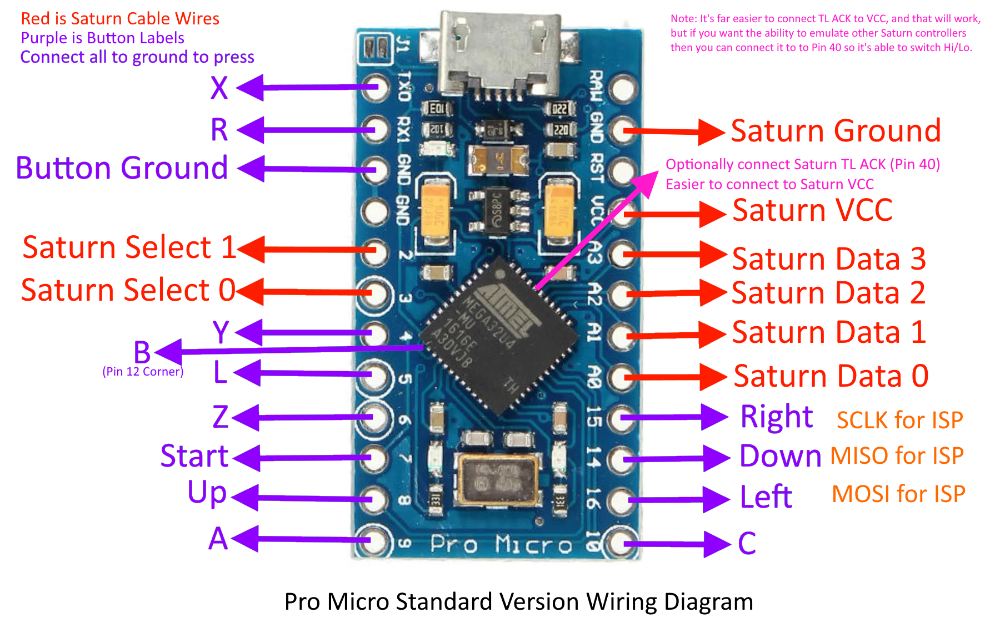
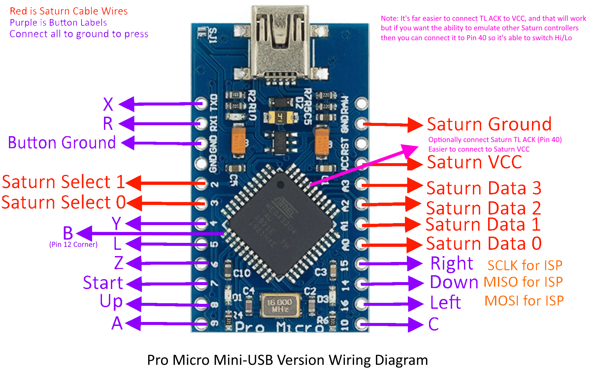

# Arduino-Saturn-Controller
Emulates a Sega Saturn controller using an SparkFun (Arduino) Pro Micro. This uses all available pins on the Pro Micro, as well as one that isn't on the breakout. That will require you to solder direct to the ATmega32U4 pin 12. (Refer to page 3 of [this datasheet](https://ww1.microchip.com/downloads/en/DeviceDoc/Atmel-7766-8-bit-AVR-ATmega16U4-32U4_Datasheet.pdf)). I recommend using a version of the Pro Micro that is Mini USB as opposed to the far more common Micro USB. The reaosn is that it's easier to solder directly to the Atmega32U4. I've included wiring diagrams for both and it should work with either.

Wire up the Sega Saturn Controller cable according the chart below, using [this reference](https://gamesx.com/controldata/saturn.htm) where +5v (Inp) is TL ACK, and VCC is connected to Arduino VCC. 
Just wire TL ACK to VCC for simplicities sake as we're always setting it high as per Sega spec for the Saturn Controller [page 97](https://cdn.preterhuman.net/texts/gaming_and_diversion/CONSOLES/sega/ST-169-R1-072694.pdf).
You can optionally wire it to ATMega32u4 pin 40, which is PF1, and this code will set it high. This enables you to reporgram this to emulate a 3D controller one day. Though that pin is more difficult to solder directly to than pin 12 was above.

Once you've put all of this together, wire each button as below, combining it with GND on the other side. Setting buttons low is what triggers a button press.

## Programming your Pro Micro
In order to program the Pro Micro, you'll need to do it manually. There is some INO Arduino IDE code, but it's not fast enough to work on the Sega Saturn due to extremely tight timings required. So you'll need to compile and flash the assembly code. I won't go into all of the details, but I've created a few scripts to help, they'll likely need editing in order to work on your machine though. I flashed my Pro Micro over ISP using another Arduino. (See [here](https://www.arduino.cc/en/Tutorial/BuiltInExamples/ArduinoISP) for more information)

If using Microchip Studio (Formerly Atmel Studio), then load the MicrochipStudio.asm and compile with that.

If you already have Arduino IDE, you can use the compile_asm.bat / compile_asm.sh to compile the Arduino-Saturn-Controller.asm code and then flash that output.

## Wiring Diagrams

| Controller | PORT | Pro Micro         |
|------------|------|-------------------|
| Up         | PB4  | Pro Micro 8       |
| Down       | PB3  | Pro Micro 14      |
| Left       | PB2  | Pro Micro 16      |
| Right      | PB1  | Pro Micro 15      |
| A          | PB5  | Pro Micro 9       |
| B          | PB7  | ATmega32u4 Pin 12 |
| C          | PB6  | Pro Micro 10      |
| Z          | PD7  | Pro Micro 6       |
| Y          | PD4  | Pro Micro 4       |
| X          | PD3  | Pro Micro TXO     |
| R          | PD2  | Pro Micro RXI     |
| L          | PC6  | Pro Micro 5       |
| START      | PE6  | Pro Micro 7       |

|PORTB| Pro Micro          | Usage                |
|-----|--------------------|----------------------|
| PB0 | Pin 8  D17         | (Not Used)           |
| PB1 | Pro Micro 15       | **Controller Right** |
| PB2 | Pro Micro 16       | **Controller Left**  |
| PB3 | Pro Micro 14       | **Controller Down**  |
| PB4 | Pro Micro 8        | **Controller Up**    |
| PB5 | Pro Micro 9        | **Controller A**     |
| PB6 | Pro Micro 10       | **Controller C**     |
| PB7 | Pin 12 D11         | **Controller B**     |

|PORTC| Pro Micro          | Usage                |
|-----|--------------------|----------------------|
| PC0 | Not on pin-out     | (Unusable)           |
| PC1 | Not on pin-out     | (Unusable)           |
| PC2 | Not on pin-out     | (Unusable)           |
| PC3 | Not on pin-out     | (Unusable)           |
| PC4 | Not on pin-out     | (Unusable)           |
| PC5 | Not on pin-out     | (Unusable)           |
| PC6 | Pro Micro 5        | **Controller  L**    |
| PC7 | Pin 32 D13         | (Not Used)           |

|PORTD| Pro Micro          | Usage                |
|-----|------------------  |----------------------|
| PD0 | Pro Micro 3 (INT0) | **Saturn SEL0**      |
| PD1 | Pro Micro 2 (INT1) | **Saturn SEL1**      |
| PD2 | Pro Micro RXI      | **Controller R**     |
| PD3 | Pro Micro TXO      | **Controller X**     |
| PD4 | Pro Micro 4        | **Controller Y**     |
| PD5 | TXLED              | (Unusable)           |
| PD6 | Pin 26 on Chip     | (Not Used)           |
| PD7 | Pro Micro 6        | **Controller Z**     |
 
|PORTE| Pro Micro          | Usage                |
|-----|--------------------|----------------------|
| PE0 | Not on pin-out     | (Unusable)           |
| PE1 | Not on pin-out     | (Unusable)           |
| PE2 | Pin 33 (Grounded)  | (Unusable)           |
| PE3 | Not on pin-out     | (Unusable)           |
| PE4 | Not on pin-out     | (Unusable)           |
| PE5 | Not on pin-out     | (Unusable)           |
| PE6 | Pro Micro 7        | **Controller Start** |
| PE7 | Not on pin-out     | (Unusable)           |
 
|PORTF| Pro Micro          | Usage                |
|-----|--------------------|----------------------|
| PF0 | Pin 41 A5          | (Not Used)           |
| PF1 | Pin 40 A4          | **Saturn TL ACK**    |
| PF2 | Not on pin-out     | (Unusable)           |
| PF3 | Not on pin-out     | (Unusable)           |
| PF4 | Pro Micro A3       | **Saturn D3**        |
| PF5 | Pro Micro A2       | **Saturn D2**        |
| PF6 | Pro Micro A1       | **Saturn D1**        |
| PF7 | Pro Micro A0       | **Saturn D0**        |

Credits to [MickGyver](https://github.com/MickGyver) for the inspiration with his [DaemonBite-Arcade-Encoder](https://github.com/MickGyver/DaemonBite-Arcade-Encoder)
